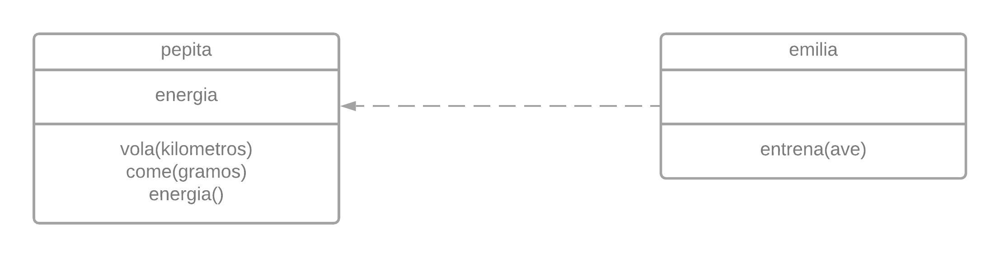
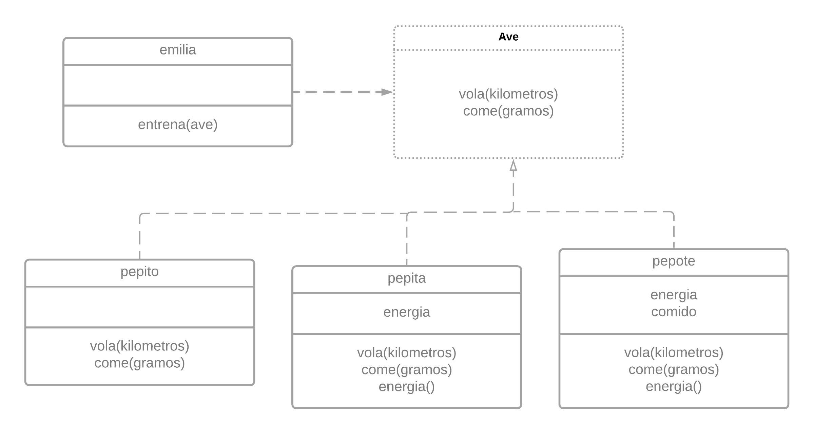

# 00 - Paradigma Objetos

Trabajaremos con *wollok*. Se trata de un paradigma menos declarativo, facil de llevarlo al iterativo.

En general, la propuesta es simplificar un problema, es combinar estructura de clases y logica, con la idea de 'objeto'.

## Temas vistos:

- Paradigma
  - Nociones Generales
  - Definicion de paradigma
- Conceptos Basicos
  - Objeto
  - Metodo, Mensaje e Interfaz
  - Atributo, Referencia y Estado interno.
  - Delegacion, Encapsulamiento y  Polimorfismo
- Wollok

## Objeto

De los objetos nos van a intersar:

- Exponen una **interfaz**: un conjunto de *mensajes*, donde los mensajes son las unicas maneras de interactuar con un objeto.
- Pueden tener **estado interno**.
- Tiene una **identidad**.

Nuestra definicion de programa sera entonces, un conjunto de objetos que se comunican entre si enviandose mensajes unos a otros.

El objeto es una unidad de logica auto-contenida. Por lo cual la interfaz juega un papel muy importante.

Los mensajes que un objeto entienda son resultado de poseer metodos, que son una lista de operaciones. A esta implementacion llamamos metodos.

Sobre el estado interno, no todos tienen atributos, referencias a otros objetos. Estos atributos son mutables.

En cuanto a la identidad, un objeto es unico, de existir otro con mismos atributos, tendriamos dos objetos.

## Wollok

Una ornitologa,  Emilia, nos pide ayuda para estudiar el consumo energetico de Pepita, la golondrita tijerita.
Volar consume energia de Pepita, la cual recupera comiendo.

```js
object pepita{
    var energia = 100

    method vola(kilometros){
        energia = energia - kilometros * 2
    }

    method come(gramos){
        energia = energia + gramos * 10
    }

    method energia() = energia
}

object emilia{
    method entrena(ave){
        ave.come(5)
        ave.vola(10)
        ave.come(5)
    }
}
```

Solemos representar a un objeto con un diagrama estatico. Diagrama de clase.



## Conceptos Claves

Debemos tener cuidado con el paradigma, ya que mal entendido podria ser una forma de programa estructurado.

**Encapsulamiento**, un objeto esta encapsulado, si de alguna manera nos oculta, "nos protege" de su implementacion. La capa visible es su interfaz, no necesito saber las logicas de sus metodos, pero si que mensajes aceptan.

**Delegacion**, elegir que delegar en que objeto, como distribuir l as responsabilidades, que entidades reutilizar va a ser todo en este paradigma.

**Polimorfismo** en objetos implica que un objeto pueda usar indistintamente a otros dos o mas objetos sin preocuparse por tratarlos diferentes. Todo objeto que envia un mensaje no le importa a quien se lo manda sino que lo entienda.

Volviendo a nuestro ejemplo. Emilia no depende de Pepita, sino que puede interactuar con cualquier objeto que sepa entender los mensajes *vola* y *come*. Por lo cual podemos redefinir nuestro modelo con una **interfaz**.



Si se sumase Pepote, un aguila que ademas come otros animales, podria ser entrenado por Emilia, si supiera interpretar vola y comer, sin importar como se realiza esta logica. Lo mismo se sumase otro Pepito.

Evitaremos los switch cases, considerandolos anti-patron, por ahora.

## Diseñando en Pos del Polimorfismo

Sobre el mismo ejemplo supongamos ahora con Pepaza la ganza, y Pepudo el pinguino

```js
object pepaza{
    method volar(kilometros)
    method come()
    nadar()
}


object pepudo{
    method come(gramos)
    nada()
}
```

Vemos como *volar* no se acorda a la interfaz *vola*. Si bien esto puede ser arregalo ajustadolo para que concuerde, debe tenerse cuidado con si otro objeto no utiliza tambien ese metodo.

Ahora Pepaza no esta del todo solucionado, ya que Pepaza no le importa cuantos gramos come. La solucion polimorfica nos lleva a agregarle parametros, aunque no lo usen. Podemos dar por solucionada a Pepaza.

Con Pepudo la situacion se complica, ya que para nuesto modelo, segun la interfaz, las aves vuelan, y los pinguinos no, por lo que a efectos de nuestro modelo, Pepudo no es un '*ave*', y no podra ser entrenando por Emilia.

## Practica del dia

Implementar a Ramiro, que cuando entrena un ave, la hace volar 15 km, cuando esta de buen humor, y cuando no el doble. Esta de mal humor porque esta cansado, y esta cansado cuando durmio menos de 8 horas.

```js
object ramiro{

    var horasDormidas = 0

    method horasDormidas() = horasDormidas

    method horasDormidas(horas) {horasDormidas = horas}

    method estaDeBuenHumor() = horasDormidas >= 8

    method entrena(ave){
        const distancia = if(self.estaDeBuenHumor()) 15 else 30
        vola(distancia)
    }
}
```